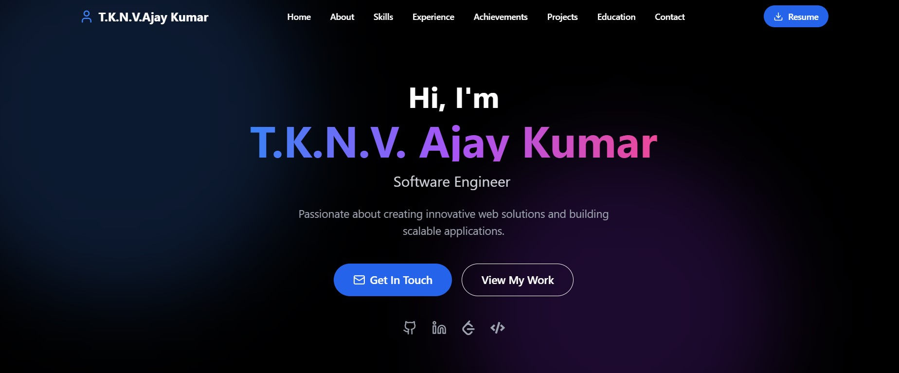

# 💼 Portfolio

**Live Demo:** [https://portfolio-git-master-kasi-ajays-projects.vercel.app/](https://portfolio-git-master-kasi-ajays-projects.vercel.app/)

This is a modern, fully responsive personal portfolio website created using React, TypeScript, Vite, and Tailwind CSS. It showcases my skills, projects, achievements, experience, and allows recruiters or collaborators to connect with me easily.

---

## 📸 Preview




---

## 📌 Features

- 🔹 Hero Banner with name and role
- 🧑‍💼 About Me section
- 🧠 Skills display
- 🛠️ Projects with images and categories
- 🎓 Education & Experience timeline
- 🏆 Achievements highlights
- 📬 Contact form or section
- 📄 Resume PDF download
- 🌙 Clean UI and responsive design for all devices

---

## 🛠️ Tech Stack

### 🧩 Frontend
- **React** (with **TypeScript**): Component-based UI
- **Vite**: Blazing-fast build tool
- **Tailwind CSS**: Utility-first styling framework

### 🛠 Tooling & Configuration
- **ESLint**: For code linting and consistency
- **PostCSS**: Tailwind integration
- **tsconfig**: TypeScript project setup

### 🗃 Assets
- Stored in `/public` (images, resume.pdf)

### 🚀 Deployment
- **Vercel**: Hosting and continuous deployment


## 🚀 Getting Started Locally

### 1. Clone the repository

```bash
git clone https://github.com/your-username/kasi-ajay-portfolio.git
cd kasi-ajay-portfolio
````

### 2. Install dependencies

```bash
npm install
```

### 3. Run the development server

```bash
npm run dev
```

Visit `http://localhost:5173` to view the website locally.

---

## 📝 Customization

You can update:

* Personal info and intro: `HeroSection.tsx`
* Projects: `ProjectsSection.tsx`
* Achievements:`Achievements.tsx`
* Skills and tech stack: `SkillsSection.tsx`
* Resume file: Replace `public/resume.pdf`
* Images: Inside `public/` folder

---

## 📬 Contact

Feel free to reach out via:

- 📧 Email: [tkasiajay@gmail.com](mailto:tkasiajay@gmail.com)
- 🔗 LinkedIn: [linkedin.com/in/kasi-ajay-tekkali-94042b28a](https://www.linkedin.com/in/kasi-ajay-tekkali-94042b28a/)

---
## 📝 License

This project is licensed under the **Apache License 2.0**.

